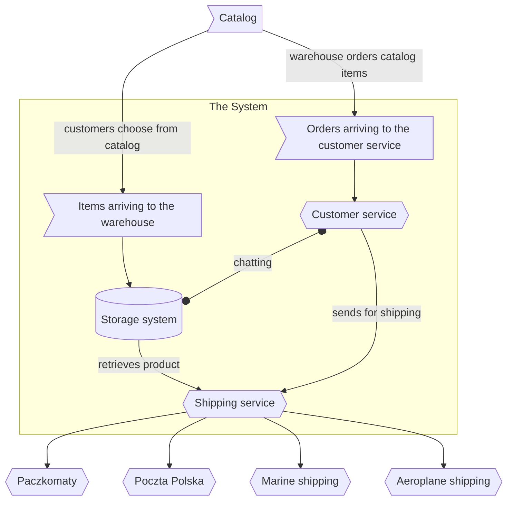

# Workshop

## Setup

1. Make sure you have .NET 7 SDK installed
   1. In case you do not here's a helpful link: [LINK](https://dotnet.microsoft.com/en-us/download/dotnet/7.0)
1. Pull this repository 
1. Install needed dotnet-* tools 
1. Install [PerfView](https://github.com/microsoft/perfview/releases/tag/v3.1.2) ... if you can 

### Installing dotnet-* tools

Issue following commands once .NET SDK is installed in a terminal of choice
```bash
dotnet tool install --global dotnet-counters
dotnet tool install --global dotnet-trace
dotnet tool install --global dotnet-gcdump
```

### Installing PerfView

Go to [this site](https://github.com/microsoft/perfview/releases/tag/v3.1.2) and download PerfView.exe.
Keep in mind to copy it out of Downloads directory to e.g C:\workshop. 
It is an executable that just runs, no need to perform further installation steps.

This is due to the fact that Download is located in $USER directory that might contain non-ascii characters.

## The Application

### Warehouse & Shipping system

We'll be profiling simple, not to say dumb, application modelling a warehouse. It is a console app.

It's been written to exhibit some performance problem deliberately. 
You should be able to find those problems simply by looking at the code, since the application is simple.
This will not be the case in real production system, so the goal of this workshop is to teach tools useful in 
finding sources of problems real application might suffer from.

Below is a chart depicting operations of said warehouse system.



## Tasks for you

### Start the application

Run following commands in a separate terminal. Do not close this terminal.

```bash
cd ./Warehouse.Main
dotnet run -C Release
```

### dotnet-counters

First step has little to do with actual profiling. 
`dotnet-counters` is a tool that displays metrics about current state of application. 
It does not require any setup inside the application, it works out of the box.

The same metrics can be exported to various tools such as Grafana or DataDog. 

Run following command in a new terminal window.

```bash
dotnet-counters monitor -n Warehouse.Main
```

You should see something like this in your terminal.

```
[System.Runtime]
    % Time in GC since last GC (%)                                         3
    Allocation Rate (B / 1 sec)                                         3,78e+08
    CPU Usage (%)                                                          6,341
    Exception Count (Count / 1 sec)                                        0
    GC Committed Bytes (MB)                                               69,603
    GC Fragmentation (%)                                                   2,639
    GC Heap Size (MB)                                                     70,341
    Gen 0 GC Count (Count / 1 sec)                                        13
    Gen 0 Size (B)                                                   382 424
    Gen 1 GC Count (Count / 1 sec)                                        11
    Gen 1 Size (B)                                                 2 605 128
    Gen 2 GC Count (Count / 1 sec)                                        11
    Gen 2 Size (B)                                                36 622 888
    IL Bytes Jitted (B)                                              168 083
    LOH Size (B)                                                  25 553 096
    Monitor Lock Contention Count (Count / 1 sec)                        418
    Number of Active Timers                                                0
    Number of Assemblies Loaded                                           20
    Number of Methods Jitted                                           5 519
    POH (Pinned Object Heap) Size (B)                                 39 952
    ThreadPool Completed Work Item Count (Count / 1 sec)                   0
    ThreadPool Queue Length                                                0
    ThreadPool Thread Count                                                1
    Time spent in JIT (ms / 1 sec)                                         2,659
    Working Set (MB)                                                     105,611
```

Using this data we can get general idea what is wrong and apply appropriate tools.